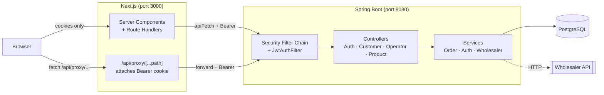
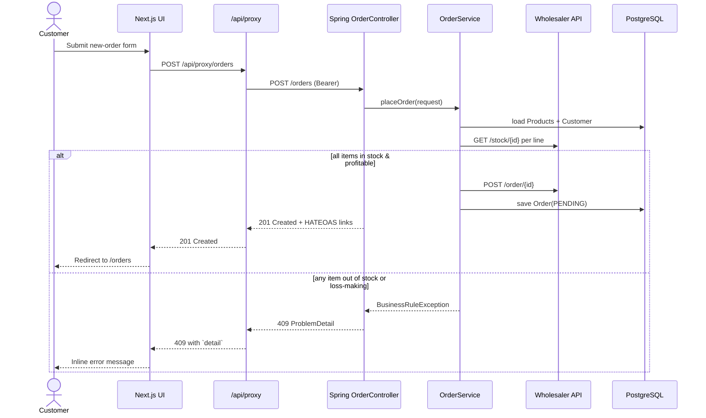

# Order Management System

A full-stack drop-shipping order management platform: Spring Boot REST API on the back, Next.js 16 App Router on the front, Postgres underneath, wired up with Docker Compose and CI.

This started life as the CSCU9YW Web Services coursework assignment. This repo is the portfolio rebuild on top of it: JWT auth, HATEOAS responses, an external wholesaler integration, containerised deployment, and a typed UI to drive it all.

---

## Stack

| Layer | Tech |
| --- | --- |
| Backend | Spring Boot 3.3, Java 17, Spring Security, Spring Data JPA, Flyway, Hibernate, springdoc-openapi |
| Database | PostgreSQL 16 (prod), H2 in-memory (dev profile) |
| Frontend | Next.js 16 (App Router), React 19, TypeScript 5, Tailwind CSS 4 |
| Auth | JWT access tokens (15 min) + opaque refresh tokens (7 d), RFC 7807 problem responses |
| External | Wholesaler REST API (mocked with WireMock in tests) |
| Tests | JUnit 5, Spring `@WebMvcTest` slices, Testcontainers Postgres, WireMock, JaCoCo coverage gate |
| CI/CD | GitHub Actions (parallel backend + frontend jobs), multi-stage Dockerfiles, docker-compose |

---

## Architecture



The browser never holds the access token directly. It lives in an `oms_access` cookie that only server-side code reads. Client components hit `/api/proxy/<backend-path>`; the Next.js route handler attaches the Bearer header and forwards to Spring. No CORS, no `localStorage` token, no token in URLs.

---

## Order flow



The backend is the source of truth on stock and profitability. The UI doesn't try to pre-validate; it just surfaces `ProblemDetail.detail` when the backend rejects a request.

---

## Project layout

```
order-management-system/
├── backend/                    # Spring Boot app + Maven wrapper
│   ├── src/main/java/com/joel/ordermanagement/
│   │   ├── auth/               # login, JWT filter, refresh rotation
│   │   ├── customer/           # customer + user entities, register
│   │   ├── order/              # OrderController, OrderService, DTOs
│   │   ├── operator/           # operator-only endpoints (status, pricing, revenue)
│   │   ├── product/            # product catalogue
│   │   ├── wholesaler/         # external API client (WebClient + retry)
│   │   ├── exception/          # GlobalExceptionHandler → RFC 7807
│   │   └── config/             # SecurityConfig, OpenApiConfig
│   ├── src/main/resources/
│   │   ├── application.yml              # shared config
│   │   ├── application-dev.yml          # H2 in-memory
│   │   ├── application-prod.yml         # Postgres + Flyway
│   │   └── db/migration/                # V1__*.sql, V2__*.sql
│   ├── src/test/java/...                # slice tests + integration test
│   ├── Dockerfile                       # multi-stage JDK build → JRE runtime
│   └── pom.xml                          # JaCoCo check bound to verify
│
├── frontend/                   # Next.js 16 App Router
│   ├── src/app/
│   │   ├── api/
│   │   │   ├── auth/{login,logout}/route.ts   # sets/clears cookies
│   │   │   └── proxy/[...path]/route.ts       # authed backend proxy
│   │   ├── login/                             # client form
│   │   ├── orders/                            # list + new + cancel (customer)
│   │   ├── operator/                          # all-orders, pricing, revenue
│   │   ├── products/                          # public catalogue
│   │   └── layout.tsx                         # shared nav + palette
│   ├── src/lib/
│   │   ├── api.ts            # apiFetch + ApiError class
│   │   ├── auth.ts           # cookie constants + getSession()
│   │   └── types.ts          # mirrors backend DTOs
│   ├── Dockerfile            # standalone bundle → node:alpine
│   └── next.config.ts        # output: "standalone"
│
├── docker-compose.yml        # postgres + backend + frontend
└── .github/workflows/ci.yml  # parallel Maven verify + npm build
```

---

## Running locally

### Option 1: full stack in Docker

```bash
docker compose up --build
```

Then visit:

- UI:       http://localhost:3000
- API docs: http://localhost:8080/swagger-ui.html
- Postgres: `localhost:5432` (user `postgres` / db `oms`)

### Option 2: just the database, app in your IDE

```bash
docker compose up -d postgres
```

**Backend** (from `backend/`):
```bash
./mvnw spring-boot:run
# or with the prod profile + real Postgres
./mvnw spring-boot:run -Dspring-boot.run.profiles=prod
```

**Frontend** (from `frontend/`):
```bash
cp .env.local.example .env.local    # point API_URL at http://localhost:8080
npm install
npm run dev
```

### Seeded accounts (dev profile only)

| Role | Username | Password |
| --- | --- | --- |
| Operator | `operator` | `password123` |
| Customer | `customer` | `password123` |

The seeder is gated by `app.seed.enabled: true` in dev; `prod` disables it.

---

## Testing

```bash
# Backend: unit + slice + integration tests + JaCoCo check
cd backend && ./mvnw verify
```

Testcontainers spins up a fresh Postgres for the integration test, so Docker Desktop needs to be running. JaCoCo's `check` rule fails the build below 55% line / 30% branch coverage; the thresholds ratchet up as more integration tests land.

```bash
# Frontend: TypeScript + lint + production build
cd frontend && npm run lint && npm run build
```

`next build` does the TypeScript compile pass, so a clean build doubles as the type-safety check.

---

## Security notes

- Access tokens are **HS256** with a 15 minute TTL, readable by server code (cookie `oms_access`, not HttpOnly because server components need to forward it).
- Refresh tokens are **opaque + HttpOnly** (cookie `oms_refresh`), stored hashed in Postgres and rotated on every refresh, so a database leak doesn't yield a usable refresh token.
- `APP_JWT_SECRET` must be at least 32 characters in production. The compose default is flagged as dev-only; real deployments should inject the secret via env file or secrets manager.
- Client JS never sees the access token. The authenticated-proxy pattern at `/api/proxy/[...path]` keeps it server-side.
- All endpoints under `/operator/**` require `ROLE_OPERATOR`; `/customers/{id}/orders` enforces `customerId == principal.customerId`.

---

## CI

Every push + PR to `main` runs two parallel GitHub Actions jobs:

- **backend**: `./mvnw -B verify` (unit + slice + Testcontainers integration + JaCoCo gate). Uploads the JaCoCo HTML report + surefire output on failure.
- **frontend**: `npm ci && npm run lint && npm run build`.

Both must be green before merge.

---

## License

Private portfolio project. Not intended for redistribution.
